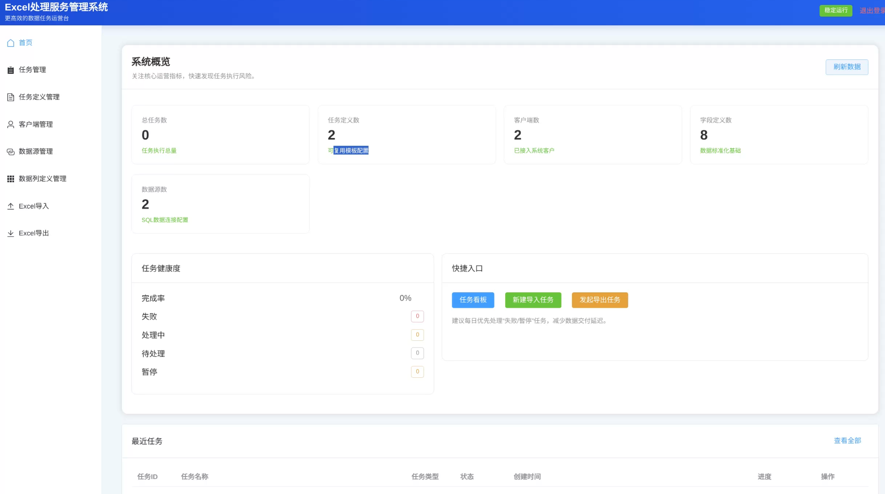
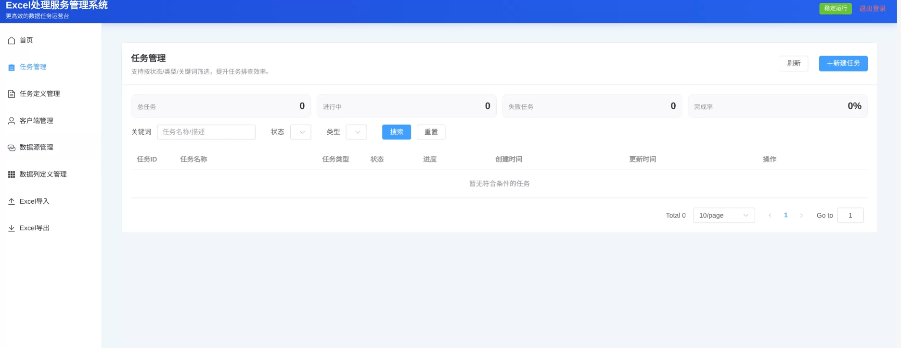
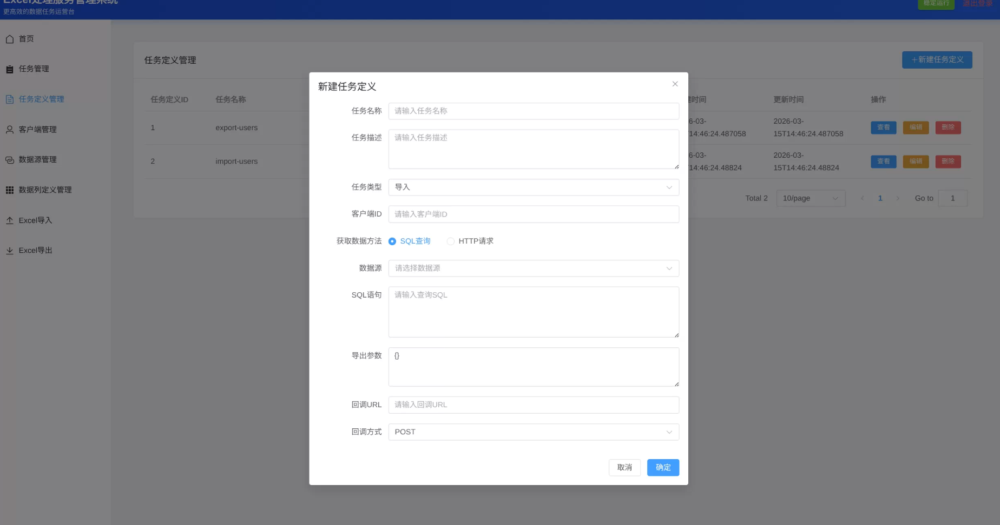
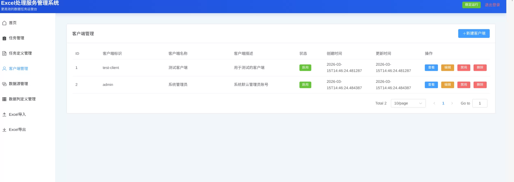
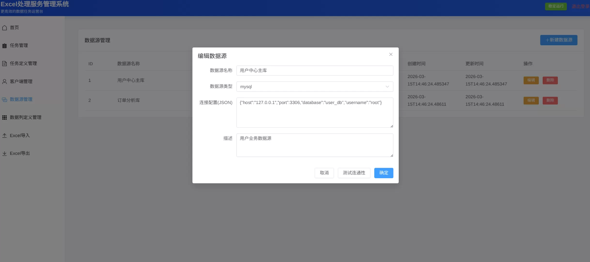
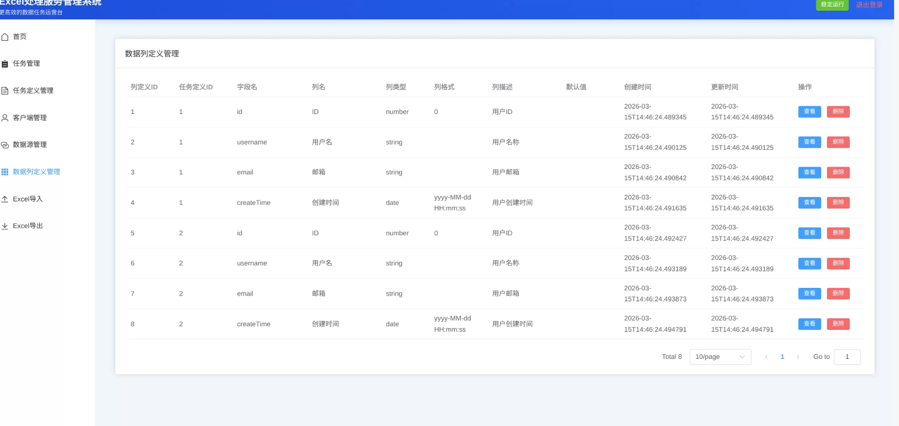
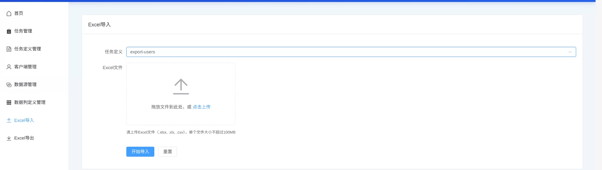
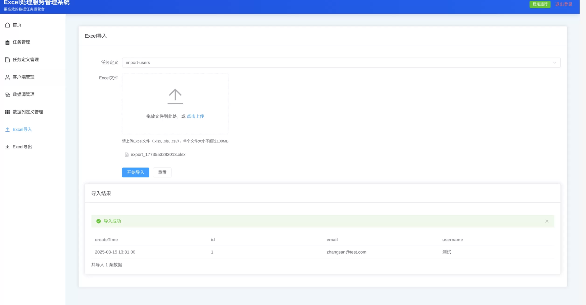
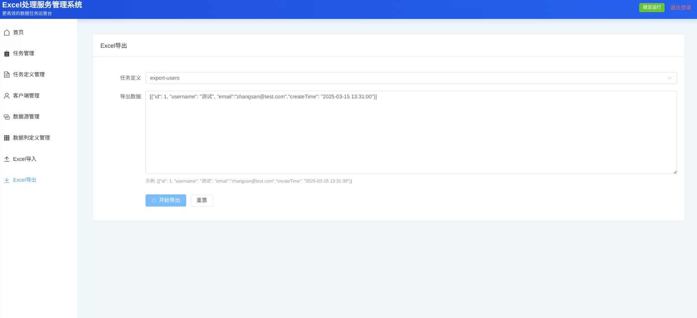

# Excel处理服务

Excel处理服务是一个前后端分离的应用程序，提供Excel文件的导入/导出功能，支持任务管理、任务定义管理、客户端管理、数据源管理和数据列定义管理。

## 项目结构

```
excel-process/
├── backend/               # 后端代码 (Spring Boot)
│   ├── src/
│   │   ├── main/
│   │   └── test/
│   ├── pom.xml
│   └── 需求文档.md
├── frontend/              # 前端代码 (Vue 3)
└── README.md              # 项目总体说明
```

## 系统概述

系统用于统一管理 **Excel 导入/导出任务**，支持：

- 客户端接入与鉴权
- 任务定义配置（导入/导出模板）
- 任务创建、查询、状态跟踪
- 数据源配置与连通性测试
- 列定义映射（字段名、列名、类型、格式）
- Excel 导入与导出执行
- 首页运营总览看板

## 用户角色

- **平台管理员**：使用 Web 管理端维护客户端、任务定义、数据源、列定义，发起导入/导出任务（使用用户账号 `username/password` 登录）
- **外部系统**：通过 API 接口创建任务，通过 `clientId + clientSecret` 完成认证

## 功能特性

- **首页总览**：系统核心运营指标、任务健康度统计、快捷入口
- **任务管理**：任务列表查询、状态筛选、详情查看、进度更新、任务删除
- **任务定义管理**：导入/导出模板配置、数据获取方式（SQL/HTTP）、回调配置
- **客户端管理**：客户端CRUD、启停状态切换、API密钥认证
- **数据源管理**：数据源CRUD、连接配置、连通性测试
- **数据列定义管理**：列映射配置（字段名、列名、类型、格式）
- **Excel导入**：解析Excel/CSV文件，返回结构化JSON数据
- **Excel导出**：查询数据并生成Excel文件下载

## 技术栈

- **后端**：Java 17+, Spring Boot 3.x, MyBatis Plus 3.5.x, Spring Cloud Alibaba 2023.x
- **前端**：Vue 3, Element Plus, Vite
- **数据库**：MySQL 8.0+
- **文件存储**：MinIO/S3兼容存储
- **缓存**：Redis
- **消息队列**：RabbitMQ
- **监控**：Prometheus + Grafana
- **分布式追踪**：Jaeger/Zipkin

## 快速开始

### 后端

1. **配置环境**
   - 安装Java 17+
   - 安装MySQL 8.0+
   - 安装Redis
   - 安装RabbitMQ
   - 安装MinIO
   - 安装Nacos

2. **配置数据库**
   - 创建数据库：`excel_process`
   - 运行初始化脚本：`backend/src/main/resources/db/schema.sql`

3. **配置应用**
   - 修改`backend/src/main/resources/application.yml`中的配置

4. **编译项目**
   ```bash
   cd backend
   mvn clean package -DskipTests
   ```

5. **启动应用**
   ```bash
   java -jar backend/target/excel-process-service-1.0.0.jar
   ```

### 前端

1. **安装依赖**
   ```bash
   cd frontend
   npm install
   ```

2. **启动开发服务器**
   ```bash
   npm run dev
   ```

3. **构建生产版本**
   ```bash
   npm run build
   ```

## 认证方式

系统采用双认证入口：

- **管理界面登录**：`POST /api/auth/user-login`，使用 `username + password` 登录；
- **SDK/外部系统登录**：`POST /api/auth/login`，使用 `clientId + clientSecret` 获取调用凭证。

除白名单接口（登录接口、外部任务接口、健康检查接口）外，其余接口均需在请求头携带 `X-API-Key`。
`X-API-Key` 可对应“启用的客户端”或“有效的管理界面用户”。
管理界面初始化管理员可通过环境变量配置：`UI_BOOTSTRAP_ADMIN_USERNAME`、`UI_BOOTSTRAP_ADMIN_PASSWORD`、`UI_BOOTSTRAP_ADMIN_DISPLAY_NAME`。

## 系统截图

### 首页总览


### 任务管理


### 任务定义管理


### 客户端管理


### 数据源管理


### 数据列定义管理


### Excel导入



### Excel导出


## API接口

后端API接口详细文档请参考 [backend/README.md](backend/README.md)

## 许可证

MIT License
