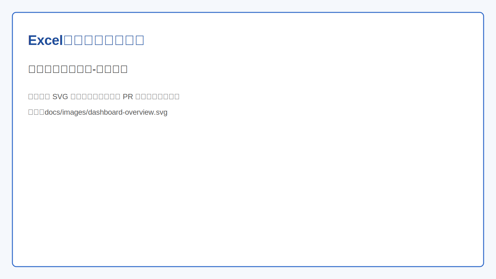
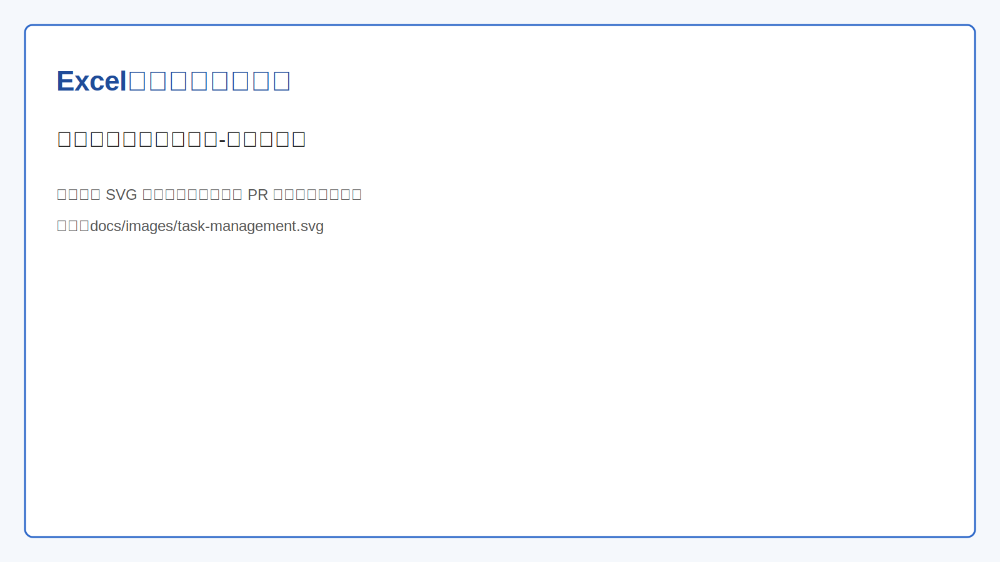
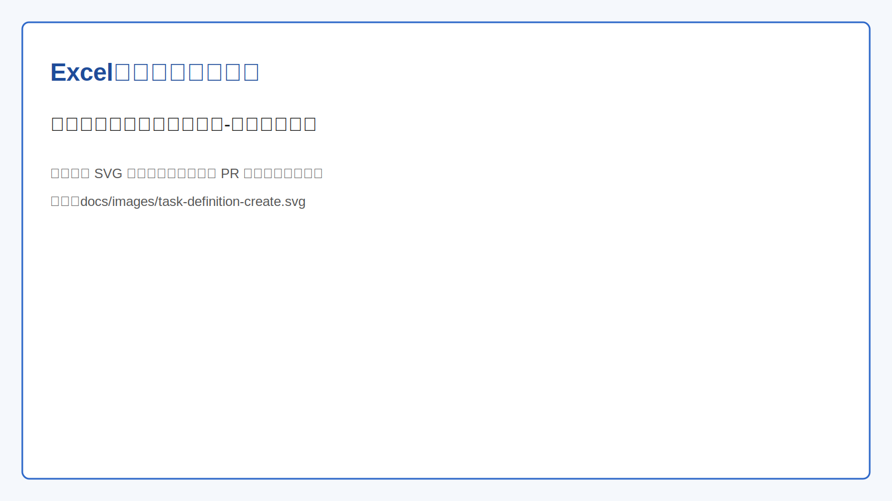
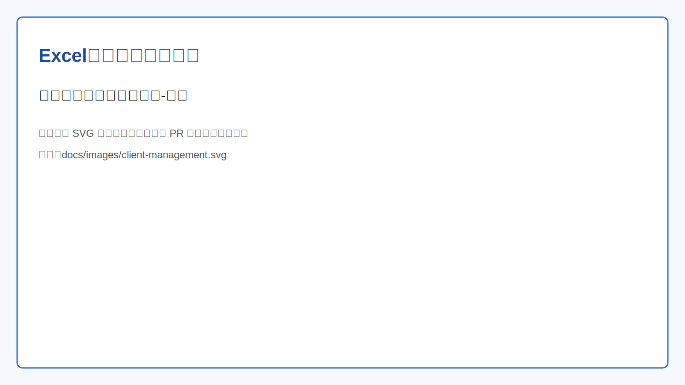
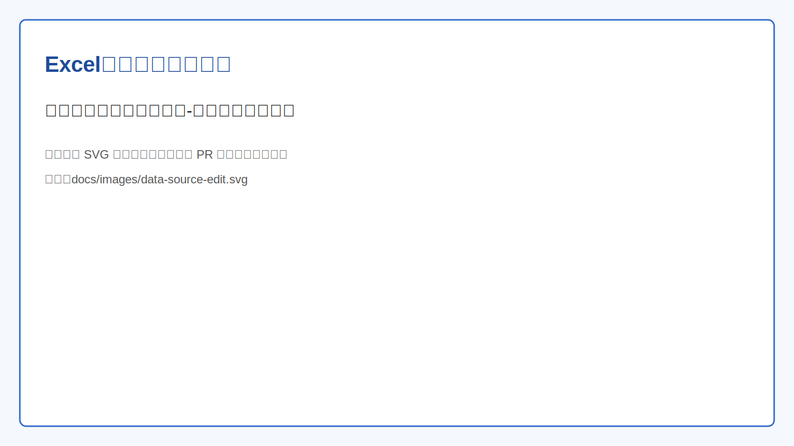
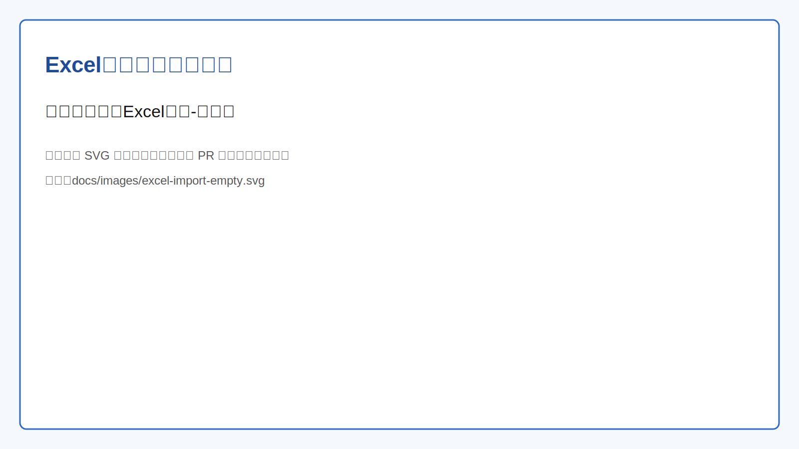
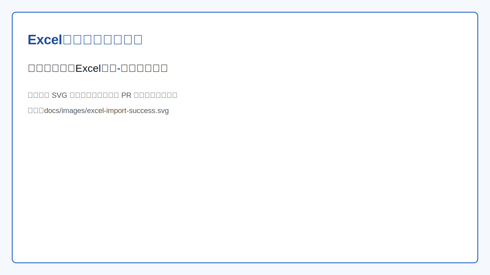
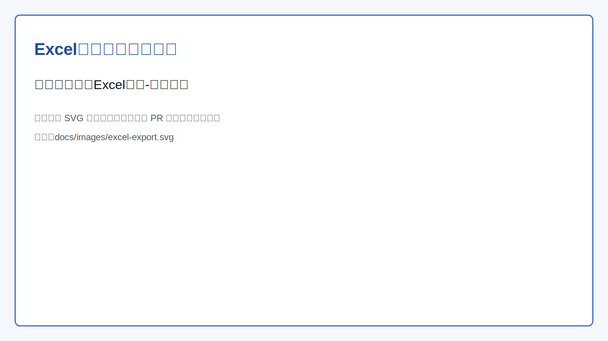

# Excel 处理服务需求文档（基于当前系统实现）

> 文档目标：以当前 `excel-process` 实际实现为准，整理一份可用于产品、测试、实施对齐的需求说明。

---

## 1. 项目概述

Excel 处理服务管理系统用于统一管理 **Excel 导入/导出任务**，覆盖：

- 客户端接入与鉴权
- 任务定义配置（导入/导出模板）
- 任务创建、查询、状态跟踪
- 数据源配置与连通性测试
- 列定义映射（字段名、列名、类型、格式）
- Excel 导入与导出执行
- 首页运营总览看板

系统定位：面向“可配置、可追踪、可扩展”的数据任务运营后台。

---

## 2. 用户角色与使用边界

### 2.1 角色定义

1. **平台管理员（后台用户）**
   - 使用 Web 管理端维护客户端、任务定义、数据源、列定义。
   - 发起导入/导出任务，查看任务状态。

2. **外部系统（API 调用方）**
   - 通过 `/api/tasks/external` 接口创建任务。
   - 通过 `clientId + clientSecret` 完成认证。

### 2.2 权限边界

- 除登录接口、外部任务接口、Mock 接口、健康检查接口外，其余接口均需认证。
- 认证方式为请求头 `X-API-Key`。
- 仅状态为“启用”的客户端允许访问受保护接口。

---

## 3. 功能需求（按模块）

## 3.1 首页总览

### 3.1.1 功能说明

首页展示系统核心运营指标与快捷入口，帮助用户快速识别任务风险与处理优先级。

### 3.1.2 展示内容

- 指标卡片：总任务数、任务定义数、客户端数、字段定义数、数据源数。
- 任务健康度：完成率、失败、处理中、待处理、暂停数量。
- 最近任务列表：最新任务记录。
- 快捷入口：任务看板、新建导入任务、发起导出任务。

### 3.1.3 配图

---

## 3.2 任务管理

### 3.2.1 功能说明

任务管理用于查看任务执行情况并进行基本运维操作。

### 3.2.2 核心能力

- 任务列表查询：支持按关键字、状态、类型筛选。
- 分页查询：支持页码、每页条数。
- 任务详情查看。
- 任务状态更新（如待处理/处理中/已完成/失败/暂停）。
- 任务进度更新（0~100）。
- 删除任务：仅允许删除“已完成”任务。

### 3.2.3 状态定义

- 待处理
- 处理中
- 已完成
- 失败
- 暂停

### 3.2.4 配图

---

## 3.3 任务定义管理

### 3.3.1 功能说明

任务定义是导入/导出任务的模板配置，任务创建时可自动继承定义中的数据获取与回调配置。

### 3.3.2 核心字段

- 基础信息：名称、描述、类型（导入/导出）、客户端 ID。
- 数据获取配置：
  - `dataFetchType`：`sql` / `http`
  - SQL 模式：数据源、查询 SQL
  - HTTP 模式：HTTP 方法、URL、是否鉴权、鉴权 URL、鉴权参数、请求参数
- 扩展参数：`params`（JSON）
- 回调配置：`callbackUrl`、`callbackMethod`

### 3.3.3 行为规则

- 名称在数据库中唯一。
- 创建任务时若指定 `taskDefinitionId`，系统将自动补齐任务数据获取配置。
- 外部任务创建时校验任务定义是否属于当前客户端。

### 3.3.4 配图

---

## 3.4 客户端管理

### 3.4.1 功能说明

客户端是系统 API 调用主体，包含访问身份与启停状态。

### 3.4.2 核心能力

- 客户端 CRUD。
- 按 `clientId` 查询客户端。
- 启用/禁用状态切换。
- 登录接口校验 `clientId + clientSecret`。

### 3.4.3 默认初始化

系统启动时自动确保 `admin/admin123` 存在且状态为启用。

### 3.4.4 配图

---

## 3.5 数据源管理

### 3.5.1 功能说明

数据源管理用于维护 SQL 任务的数据连接信息。

### 3.5.2 核心能力

- 数据源 CRUD。
- 连接配置 JSON 维护（至少包含 `host`、`port`）。
- 连通性测试：创建前/测试时通过 Socket 检查地址与端口可达性（3 秒超时）。

### 3.5.3 配图

---

## 3.6 数据列定义管理

### 3.6.1 功能说明

列定义用于描述 Excel 列与业务字段的映射关系，是导入与导出的统一结构描述。

### 3.6.2 核心字段

- `taskDefinitionId`：所属任务定义
- `fieldName`：字段名（程序字段）
- `columnName`：列名（Excel 展示列）
- `columnType`：列类型（如 number/string/date）
- `columnFormat`：列格式（如日期格式）
- `description`、`validationRules`、`defaultValue`、`mappingRules`

### 3.6.3 核心能力

- 列定义 CRUD。
- 按任务定义 ID 查询与批量删除。

### 3.6.4 配图

---

## 3.7 Excel 导入

### 3.7.1 功能说明

按任务定义加载列定义后，解析上传文件并返回结构化数据结果。

### 3.7.2 输入约束

- 文件参数：`file`
- 任务定义参数：`taskDefinitionId`
- 支持扩展名：`.xlsx`、`.xls`、`.csv`（前端提示）
- 单文件大小前端限制：100MB

### 3.7.3 处理逻辑

- 根据 `taskDefinitionId` 查询列定义。
- 优先按 Excel 表头与 `columnName` 映射；若无表头匹配，回退为按索引映射。
- 输出：
  - `success`
  - `data`（数组）
  - `count`（导入记录数）

### 3.7.4 配图

---

## 3.8 Excel 导出

### 3.8.1 功能说明

按任务定义加载列定义，将 JSON 数据按字段顺序写入 Excel 并下载。

### 3.8.2 输入参数

- `taskDefinitionId`
- `data`（JSON 字符串，数组结构）

### 3.8.3 输出行为

- 响应类型：`application/vnd.openxmlformats-officedocument.spreadsheetml.sheet`
- 下载文件名：`export.xlsx`

### 3.8.4 配图

---

## 4. 任务处理关键流程

## 4.1 后台创建任务流程

1. 管理端传入任务数据，并携带 `X-API-Key`。
2. 系统校验 API Key 对应客户端是否启用。
3. 若传入 `taskDefinitionId`，从任务定义合并数据获取配置。
4. 初始化任务状态为“待处理”，进度 0，写入创建时间。

## 4.2 外部系统创建任务流程

1. 外部系统调用 `/api/tasks/external`，提交 `clientId/clientSecret` 与任务参数。
2. 系统验证客户端身份。
3. 校验任务定义归属客户端（若任务定义配置了 `clientId`）。
4. 自动继承任务定义配置并创建任务。

## 4.3 Excel 导入流程

1. 上传文件与任务定义 ID。
2. 加载列定义映射。
3. 解析 Excel 数据。
4. 返回解析后的 JSON 结果供业务方二次处理。

## 4.4 Excel 导出流程

1. 提交任务定义 ID 与待导出 JSON 数据。
2. 加载列定义顺序与列名。
3. 生成 Excel 并通过 HTTP 下载。

---

## 5. 接口需求（按实现落地）

### 5.1 鉴权与登录

- `POST /api/auth/login`
  - 入参：`clientId`、`clientSecret`
  - 出参：`apiKey`、`clientName`、`expiresIn`

### 5.2 任务接口

- `POST /api/tasks` 创建任务（需 API Key）
- `POST /api/tasks/external` 外部创建任务（免 API Key）
- `GET /api/tasks` 任务列表（可按状态）
- `GET /api/tasks/query` 条件分页查询
- `GET /api/tasks/{id}` 任务详情
- `PUT /api/tasks/{id}/status` 更新状态
- `PUT /api/tasks/{id}/progress` 更新进度
- `DELETE /api/tasks/{id}` 删除已完成任务

### 5.3 任务定义接口

- `POST /api/task-definitions`
- `GET /api/task-definitions`
- `GET /api/task-definitions/{id}`
- `PUT /api/task-definitions/{id}`
- `DELETE /api/task-definitions/{id}`
- `GET /api/task-definitions/name/{name}`
- `GET /api/task-definitions/client/{clientId}`

### 5.4 客户端接口

- `POST /api/clients`
- `GET /api/clients`
- `GET /api/clients/{id}`
- `PUT /api/clients/{id}`
- `DELETE /api/clients/{id}`
- `GET /api/clients/client-id/{clientId}`
- `PUT /api/clients/client-id/{clientId}/status`

### 5.5 数据源接口

- `POST /api/data-sources/test-connection`
- `POST /api/data-sources`
- `GET /api/data-sources`
- `GET /api/data-sources/{id}`
- `PUT /api/data-sources/{id}`
- `DELETE /api/data-sources/{id}`

### 5.6 列定义接口

- `POST /api/column-definitions`
- `GET /api/column-definitions`
- `GET /api/column-definitions/{id}`
- `PUT /api/column-definitions/{id}`
- `DELETE /api/column-definitions/{id}`
- `GET /api/column-definitions/task-definition/{taskDefinitionId}`
- `DELETE /api/column-definitions/task-definition/{taskDefinitionId}`

### 5.7 Excel 接口

- `POST /api/excel/import`
- `POST /api/excel/export`

### 5.8 看板接口

- `GET /api/dashboard/overview?recentLimit=6`

---

## 6. 数据需求

## 6.1 核心数据表

- `client`：客户端信息与认证状态
- `data_source_config`：数据源连接配置
- `task_definition`：任务模板定义
- `task`：任务实例与执行状态
- `column_definition`：列映射定义

## 6.2 关键约束

- `client.client_id` 唯一
- `task_definition.name` 唯一
- `data_source_config.name` 唯一
- `task` 关联 `task_definition`
- `column_definition` 关联 `task_definition`

---

## 7. 非功能需求（按现有实现）

### 7.1 安全性

- Spring Security + 自定义 API Key 过滤器。
- 未授权访问统一返回 401。
- 白名单接口：登录、外部任务、Mock 数据源、健康检查。

### 7.2 可观测性

- 健康检查：`/actuator/health`
- 基础信息：`/actuator/info`

### 7.3 兼容性

- 后端：Java 17、Spring Boot 3。
- 数据库：MySQL（生产）/H2（测试）。
- Excel 处理：EasyExcel。

---

## 8. 页面配图索引

- 首页总览：`dashboard-overview.svg`
- 任务管理：`task-management.svg`
- 任务定义管理：`task-definition-create.svg`
- 客户端管理：`client-management.svg`
- 数据源管理：`data-source-edit.svg`
- 列定义管理：`column-definition-list.svg`
- Excel 导入（空态）：`excel-import-empty.svg`
- Excel 导入（成功）：`excel-import-success.svg`
- Excel 导出：`excel-export.svg`

> 注：上述图片文件已放置于仓库 `docs/images/` 目录，可通过本文档中的相对路径直接访问。
