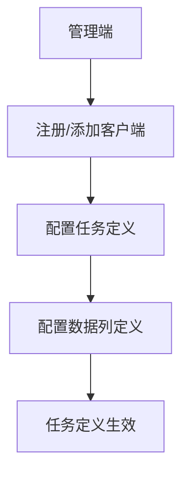
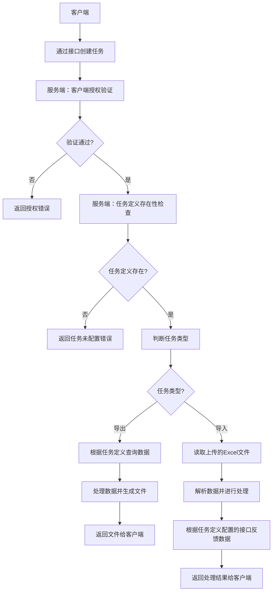

# Excel处理服务需求文档

## 1. 功能需求

### 1.1 任务管理功能

**1.1.1 任务状态定义**
- **待处理**：任务已创建但尚未开始处理
- **处理中**：任务正在处理中
- **已完成**：任务处理成功完成
- **失败**：任务处理失败
- **暂停**：任务处理被暂停
- **取消**：任务处理被取消

**1.1.2 任务管理操作**
- 配置任务定义：包括任务名称、描述、任务类型、客户端、导出参数、任务回调接口等
- 创建任务：客户端通过接口创建任务，包含任务名称、客户端信息、导出参数、导入参数等
- 查看任务列表（支持按状态、类型、时间等筛选）
- 查看任务详情
- 删除任务（仅支持删除状态为"已完成"的任务）
- 暂停任务（支持暂停状态为"处理中"的任务）
- 取消任务（支持取消状态为"待处理"或"暂停"的任务）
- 重试任务（支持重试状态为"失败"的任务）

**1.1.3 任务定义配置**
- 任务名称：唯一标识任务的名称
- 任务描述：任务的详细描述
- 任务类型：导入/导出
- 客户端：关联的客户端（用于权限控制）
- 导出参数：
  - 是否分批：是/否
  - 分批大小：默认10000行/批
  - 导出文件格式：csv或excel
  - 分页参数：
    - 每页数据量：默认10000行
    - 总页数：自动计算
  - 查询数据接口：
    - 数据库查询语句
    - 自定义接口URL和参数
- 导入参数：
  - 导入模式：覆盖/追加/更新
  - 数据校验规则：必填、长度限制、格式验证等
  - 反馈接口：数据处理完成后调用的接口地址
- 任务回调接口：
  - 回调URL：任务完成后调用的接口地址
  - 回调方式：HTTP GET/POST
  - 回调参数：包含任务ID、状态、结果等信息
  - 回调重试：最多3次，每次间隔30秒

**1.1.4 任务回调机制**
- 任务完成后自动调用配置的回调接口
- 回调接口支持HTTP/HTTPS协议
- 回调数据格式：JSON格式，包含任务ID、状态、结果等信息
- 回调失败时支持重试机制（最多3次，每次间隔30秒）

**1.1.5 任务处理流程**
1. 客户端通过接口创建任务
2. 服务端根据客户端信息判断是否授权访问
3. 根据任务名称判断任务定义是否存在
   3.1 若存在，根据任务类型处理
   3.2 若不存在，返回任务未配置错误
4. 判断任务类型
   4.1 导出：根据任务定义配置的接口查询数据并处理返回文件
   4.2 导入：读取完成数据后根据任务定义配置的接口反馈给客户端

### 1.2 导入功能

**1.2.1 导入流程**
- 上传Excel文件
- 解析Excel文件，提取数据
- 根据数据列定义进行映射
- 对提取的数据进行处理（格式转换、数据校验、数据合并等）
- 将处理后的数据以JSON格式返回
- 支持导入进度实时查询
- 支持导入过程中的错误处理和日志记录

**1.2.2 导入参数**
- 文件类型：支持.xlsx、.xls格式
- 文件大小限制：最大100MB
- 数据量限制：单次导入最多支持100万行数据
- 导入模式：
  - 覆盖模式：完全替换现有数据
  - 追加模式：在现有数据基础上添加新数据
  - 更新模式：根据主键更新现有数据

### 1.3 导出功能

**1.3.1 导出流程**
- 接收导出请求，包含导出参数
- 从数据库或接口中查询对应的数据
- 根据数据列定义进行映射
- 对查询到的数据进行处理
- 将处理后的数据以Excel文件格式返回
- 支持导出进度实时查询
- 支持大数据量导出（分批处理）
- 支持导出结果通知

**1.3.2 导出参数**
- 导出格式：支持.xlsx、.xls、.csv格式
- 分批参数：
  - 是否分批：是/否
  - 分批大小：默认10000行/批
  - 总批数：自动计算
- 分页参数：
  - 每页数据量：默认10000行
  - 总页数：自动计算
- 查询参数：
  - 数据库查询语句
  - 自定义接口调用参数

### 1.4 数据列定义管理

**1.4.1 数据列定义配置**
- 字段名
- 列名
- 列类型（文本、数字、日期、布尔值等）
- 列格式（日期格式、数字格式等）
- 列描述
- 关联任务定义
- 数据校验规则（必填、长度限制、格式验证等）
- 默认值
- 映射规则（如：字典映射、公式计算等）

**1.4.2 数据列定义操作**
- 配置数据列定义
- 查看数据列定义列表（支持按任务、类型等筛选）
- 创建数据列定义
- 删除数据列定义（仅支持删除未被使用的数据列定义）
- 修改数据列定义（仅支持修改未被使用的数据列定义）

### 1.5 系统管理功能

**1.5.1 用户管理**
- 用户注册
- 用户登录
- 密码重置
- 角色管理（管理员、普通用户）

**1.5.2 客户端管理**
- 客户端注册：生成客户端ID和密钥
- 客户端认证：基于API密钥的认证机制
- 客户端授权：控制客户端可访问的API接口
- 客户端管理：查看、编辑、删除客户端信息
- 客户端权限：控制客户端可执行的操作（如创建任务、查询任务等）

**1.5.3 权限管理**
- 基于角色的权限控制
- 功能权限（如：创建任务、删除任务等）
- 数据权限（如：只能查看自己创建的任务）

**1.5.4 系统监控**
- 任务处理状态监控
- 系统资源使用监控
- 错误日志监控

**1.5.5 日志管理**
- 操作日志记录
- 错误日志记录
- 日志查询和分析

## 2. 非功能需求

### 2.1 性能需求
- 小文件导入（<10MB）：响应时间<5秒
- 大文件导入（10-100MB）：响应时间<60秒
- 导出数据量<10万行：响应时间<30秒
- 导出数据量10-100万行：响应时间<5分钟
- 系统支持并发处理任务数：最大100个
- 系统支持并发用户数：最大500个

### 2.2 可靠性需求
- 系统可用性：99.9%
- 任务处理失败率：<0.1%
- 数据传输可靠性：100%（支持断点续传）
- 系统故障恢复时间：<5分钟

### 2.3 安全性需求
- 数据传输加密：使用HTTPS
- 数据存储加密：敏感数据加密存储
- 访问控制：基于JWT的认证机制和API密钥认证
- 防SQL注入：使用参数化查询
- 防XSS攻击：输入验证和输出编码
- 客户端认证：确保只有合法客户端能够调用API

### 2.4 可扩展性需求
- 支持水平扩展：通过集群部署提高处理能力
- 支持插件化架构：可扩展新的导入/导出格式
- 支持自定义处理逻辑：通过脚本或配置实现

## 3. 数据需求

### 3.1 数据模型

**3.1.1 任务定义表（task_definition）**
- id：任务定义ID
- name：任务名称
- description：任务描述
- type：任务类型（导入/导出）
- client_id：关联的客户端ID
- params：导出参数（JSON格式）
- callback_url：任务回调接口
- callback_method：回调方式（GET/POST）
- create_time：创建时间
- update_time：更新时间

**3.1.2 任务表（task）**
- id：任务ID
- task_definition_id：关联的任务定义ID
- name：任务名称
- description：任务描述
- type：任务类型（导入/导出）
- status：任务状态
- file_path：导入文件路径
- params：任务参数（JSON格式）
- result：处理结果（JSON格式）
- error_message：错误信息
- progress：处理进度（0-100）
- create_time：创建时间
- update_time：更新时间
- start_time：开始处理时间
- end_time：结束处理时间

**3.1.3 数据列定义表（column_definition）**
- id：列定义ID
- task_definition_id：关联的任务定义ID
- field_name：字段名
- column_name：列名
- column_type：列类型
- column_format：列格式
- description：列描述
- validation_rules：校验规则（JSON格式）
- default_value：默认值
- mapping_rules：映射规则（JSON格式）
- create_time：创建时间
- update_time：更新时间

**3.1.4 用户表（user）**
- id：用户ID
- username：用户名
- password_hash：密码哈希
- role：角色
- create_time：创建时间
- update_time：更新时间

**3.1.5 客户端表（client）**
- id：客户端ID
- client_id：客户端标识
- client_secret：客户端密钥（加密存储）
- client_name：客户端名称
- client_desc：客户端描述
- status：客户端状态（启用/禁用）
- create_time：创建时间
- update_time：更新时间

**3.1.6 操作日志表（operation_log）**
- id：日志ID
- user_id：操作用户ID
- client_id：客户端ID
- operation_type：操作类型
- operation_detail：操作详情
- create_time：操作时间

### 3.2 数据存储
- 关系型数据库：MySQL 8.0+
- 文件存储：MinIO/S3兼容存储
- 缓存：Redis（用于任务状态管理和临时数据）

### 3.3 数据备份
- 数据库备份：每日全量备份，每小时增量备份
- 文件备份：定期备份到异地存储
- 备份保留期限：30天

## 4. 边界条件

### 4.1 文件处理边界
- 文件大小限制：最大100MB
- 文件格式限制：仅支持.xlsx、.xls、.csv格式
- 单文件数据量限制：最多100万行

### 4.2 任务处理边界
- 任务并发数限制：最大100个
- 任务处理超时：默认30分钟
- 任务重试次数：最多3次

### 4.3 系统资源边界
- 内存使用限制：根据部署环境调整
- CPU使用限制：根据部署环境调整
- 磁盘空间限制：至少50GB可用空间

### 4.4 接口调用边界
- 回调接口超时：30秒
- 外部接口调用超时：60秒
- 接口调用频率限制：根据外部接口要求调整
- 客户端API调用频率限制：每个客户端每分钟最多100次调用

### 4.5 客户端管理边界
- 客户端数量限制：最多1000个
- 客户端密钥长度：至少32位
- 客户端密钥有效期：默认1年
- 客户端认证失败次数限制：连续5次失败后禁用客户端

## 5. 验收标准

### 5.1 功能验收
- 任务管理功能：能够成功创建、查看、删除任务
- 导入功能：能够成功上传Excel文件并解析数据
- 导出功能：能够成功导出数据为Excel文件
- 数据列定义管理：能够成功配置和管理数据列定义
- 系统管理功能：能够成功进行用户管理和权限控制
- 客户端管理功能：能够成功注册、认证和管理客户端

### 5.2 性能验收
- 小文件导入：响应时间<5秒
- 大文件导入：响应时间<60秒
- 导出数据量<10万行：响应时间<30秒
- 导出数据量10-100万行：响应时间<5分钟
- 系统支持并发处理任务数：100个
- 系统支持并发用户数：500个

### 5.3 可靠性验收
- 系统可用性：99.9%
- 任务处理失败率：<0.1%
- 数据传输可靠性：100%
- 系统故障恢复时间：<5分钟

### 5.4 安全性验收
- 数据传输加密：使用HTTPS
- 数据存储加密：敏感数据加密存储
- 访问控制：基于JWT的认证机制和API密钥认证
- 防SQL注入：使用参数化查询
- 防XSS攻击：输入验证和输出编码
- 客户端认证：确保只有合法客户端能够调用API

## 6. 技术架构设计

### 6.1 技术栈选择
- **后端**：Java 17+, Spring Boot 3.x, MyBatis Plus 3.5.x
- **前端**：Vue 3, Element Plus
- **数据库**：MySQL 8.0+
- **文件存储**：MinIO/S3兼容存储
- **缓存**：Redis
- **消息队列**：RabbitMQ（用于异步任务处理）
- **监控**：Prometheus + Grafana
- **分布式追踪**：Jaeger/Zipkin
- **认证**：Spring Security, JWT, API Key认证

### 6.2 架构设计
- **架构风格**：微服务架构
- **模块划分**：
  - excel-process-core：核心处理模块
  - excel-process-api：API接口模块
  - excel-process-task：任务管理模块
  - excel-process-storage：文件存储模块
  - excel-process-monitor：监控模块
- **关键设计模式**：
  - 模板方法模式：用于导入/导出流程
  - 策略模式：用于不同类型的数据处理
  - 观察者模式：用于任务状态变更通知
  - 工厂模式：用于创建不同类型的处理器

### 6.3 部署方案
- **容器化**：Docker + Kubernetes
- **CI/CD**：Jenkins/GitLab CI
- **环境配置**：
  - 开发环境：本地Docker容器
  - 测试环境：Kubernetes集群
  - 生产环境：Kubernetes集群（高可用配置）

### 6.4 业务流程图

**流程一：客户端注册与任务配置流程**

**流程二：任务创建与处理流程**

## 7. 风险评估与应对措施

### 7.1 技术风险
- **风险**：处理大量数据时的性能问题
  - **应对措施**：使用分批处理、异步处理、缓存机制
- **风险**：并发请求时的系统稳定性问题
  - **应对措施**：使用线程池、限流、熔断机制
- **风险**：外部接口依赖的可靠性问题
  - **应对措施**：使用重试机制、熔断机制、降级方案

### 7.2 业务风险
- **风险**：需求变更的可能性
  - **应对措施**：采用敏捷开发方法，定期与业务方沟通
- **风险**：数据安全问题
  - **应对措施**：加强数据加密、访问控制、审计日志

### 7.3 其他风险
- **风险**：系统集成问题
  - **应对措施**：提供标准API接口，支持多种集成方式
- **风险**：运维成本问题
  - **应对措施**：自动化部署、监控告警、故障自愈

## 8. 实施计划

### 8.1 开发阶段
1. **需求分析与设计**：2周
2. **核心模块开发**：4周
3. **API接口开发**：2周
4. **前端开发**：3周
5. **测试与调优**：2周

### 8.2 部署阶段
1. **测试环境部署**：1周
2. **生产环境部署**：1周
3. **系统上线**：1周

### 8.3 维护阶段
1. **系统监控**：持续
2. **性能优化**：持续
3. **功能迭代**：按需